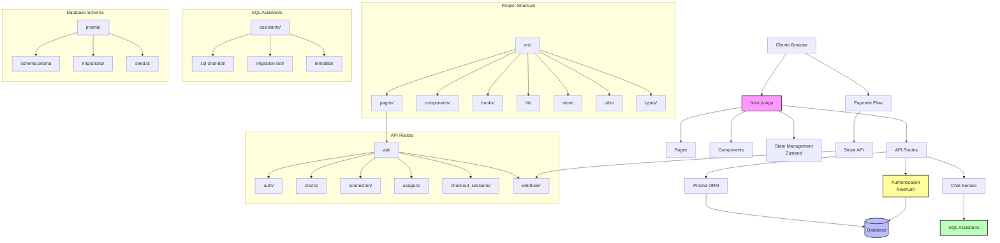

```mermaid
graph TD
    Client[Cliente Browser] --> NextJS[Next.js App]
    NextJS --> Pages[Pages]
    NextJS --> Components[Components]
    NextJS --> API[API Routes]
    NextJS --> Store[State Management\nZustand]
    API --> PrismaORM[Prisma ORM]
    PrismaORM --> Database[(Database)]
    API --> Auth[Authentication\nNextAuth]
    Auth --> Database
    API --> ChatService[Chat Service]
    ChatService --> SQLAssistants[SQL Assistants]
    
    subgraph "Project Structure"
        direction TB
        src[src/] --> srcPages[pages/]
        src --> srcComponents[components/]
        src --> srcHooks[hooks/]
        src --> srcLib[lib/]
        src --> srcStore[store/]
        src --> srcUtils[utils/]
        src --> srcTypes[types/]
    end
    
    subgraph "API Routes"
        direction TB
        srcPages --> apiRoutes[api/]
        apiRoutes --> authAPI[auth/]
        apiRoutes --> chatAPI[chat.ts]
        apiRoutes --> connectionAPI[connection/]
        apiRoutes --> usageAPI[usage.ts]
        apiRoutes --> checkoutAPI[checkout_sessions/]
        apiRoutes --> webhookAPI[webhook/]
    end
    
    subgraph "SQL Assistants"
        direction TB
        assistants[assistants/] --> sqlChatBot[sql-chat-bot/]
        assistants --> migrationBot[migration-bot/]
        assistants --> templateBot[template/]
    end
    
    subgraph "Database Schema"
        direction TB
        prisma[prisma/] --> schema[schema.prisma]
        prisma --> migrations[migrations/]
        prisma --> seed[seed.ts]
    end
    
    Client --> PaymentFlow[Payment Flow]
    PaymentFlow --> Stripe[Stripe API]
    Stripe --> webhookAPI
    
    style NextJS fill:#f9f,stroke:#333,stroke-width:2px
    style Database fill:#bbf,stroke:#333,stroke-width:2px
    style SQLAssistants fill:#bfb,stroke:#333,stroke-width:2px
    style Auth fill:#ff9,stroke:#333,stroke-width:2px
```
